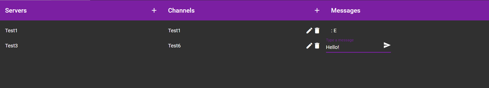

# DiscoCord

DiscoCord is a online communicator based on [Discord](http://discord.com) .

## Features

* Public / Private servers
* Channels
* Chat

## Requirements

* [.NET Core](https://dotnet.microsoft.com/download) version 4.7.2 or [Docker](https://www.docker.com/)
* [Angular CLI](https://github.com/angular/angular-cli) version 7.3.1

## Preparation

1. Unzip this into folder.
2. Go to \DiscoCord\DiscoCordAPI\DiscoCordAPI.Web.Api and create appsettings.json and fill <>
```
{
  "Logging": {
    "LogLevel": {
      "Default": "Debug",
      "System": "Information",
      "Microsoft": "Information"
    }
  },
  "AllowedHosts": "*",
  "ConnectionStrings": {
    "ApplicationContext": "Server=<SERVER_NAME>;Database=<DB_NAME>;User=<USER_NAME>;Password=<PASSWORD>;"
  }
}
```
ConnectionStrings eg.
```
"ConnectionStrings": {
   "ApplicationContext": "Server=db;Database=master;User=sa;Password=VeryStrong!Passw0rd;"
}

```
3. Go to \DiscoCord\DiscoCordAPI\
4. Run in terminal
```console
docker-compose build
```
5. After build run
```
docker-compose up
```
6. Go to \DiscoCord\DiscoCordWeb
7. Install node modules via running:
```
npm install
```
8. Starting angular server
```
npm start
```

## Screenshots:

